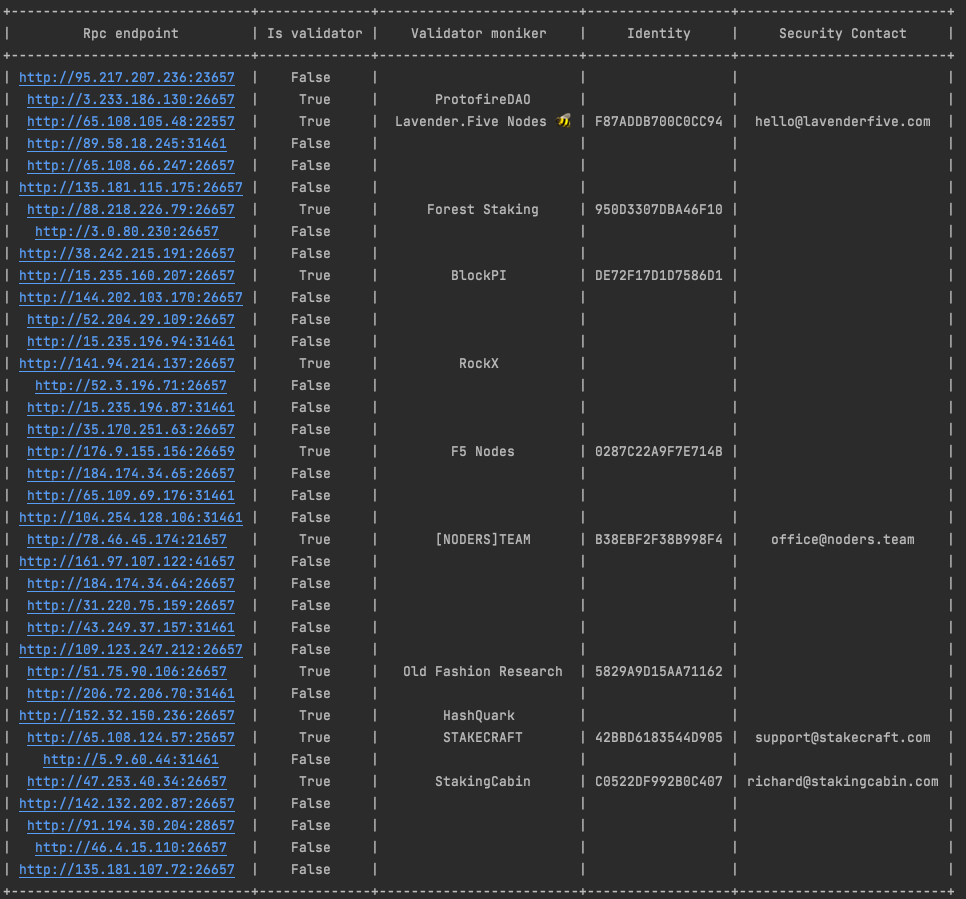

# Public rpc locator

This is an example on how easy it is to get validators with rpc port opened.
Publicly exposed validators is a security risk to the network.
Provided security contact could be used to reach out to the corresponding validator.

To run:
 * Install `requests` and `prettytable` packages with pip3.
 * Run `python3 main.py RPC_ENDPOIND API_ENDPOINT` command and give it some to execute

For example to get public rpcs for zetachain testnet run:

`python3 main.py https://zetachain-athens.blockpi.network/rpc/v1/public https://zetachain-athens.blockpi.network/lcd/v1/public`

List of up-to-date endpoint could be found

https://www.zetachain.com/docs/reference/api/

Example output

